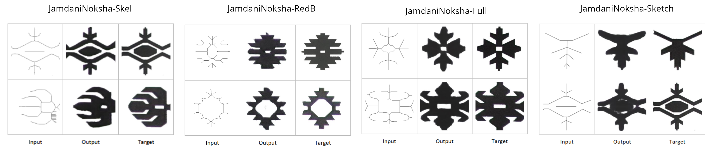
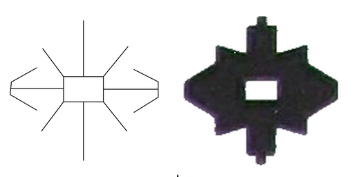
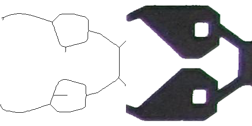
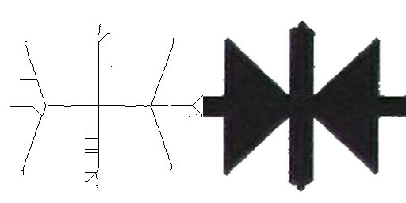
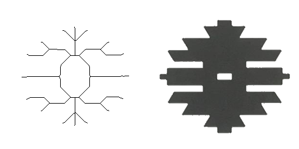
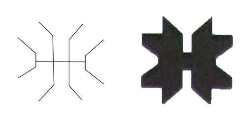

# Generative-Jamdani

Based on [pix2pix-tensorflow](https://affinelayer.com/pix2pix/) which is tensorflow port of [pix2pix](https://phillipi.github.io/pix2pix/) by Isola et al.
Visit [Jamdani Artist](https://raihan-tanvir.github.io/generative-jamdani/)  to see the live demonstration.

## Interactive Demo


Sample output generated by our Generative-Jamdani from input sketches, like these examples from the original paper:



This is an implementation of [pix2pix-tensorflow](https://github.com/affinelayer/pix2pix-tensorflow) on **Jamdani Noksha** dataset.  It is meant to be a faithful implementation of the original work and so does not add anything.  

## Setup

### Prerequisites
- Tensorflow 1.4.1

### Recommended
- Linux with Tensorflow GPU edition + cuDNN

### Getting Started

```sh
# clone this repo
git clone https://github.com/raihan-tanvir/generative-jamdani.git
cd generative-jamdani

python pix2pix.py \
  --mode train \
  --output_dir model/ \
  --max_epochs 150 \
  --input_dir dataset/train \
  --which_direction BtoA
# test the model
python pix2pix.py \
  --mode test \
  --output_dir output/ \
  --input_dir dataset/test \
  --checkpoint model/
```

The test run will output an HTML file at `output/index.html` that shows input/output/target image sets.


## Datasets

The data format used by this program is the same as the original pix2pix format, which consists of images of input and desired output side by side like:


For example:



### Datasets Link

| dataset | example |
| --- | --- |
| [Boundary Version](https://drive.google.com/file/d/1FXT7VDTgG_pOlCswMHM8iwkKHY1i09ZK/view?usp=sharing)  <br> 1116 images   |  |
| [Enhanched Resolution Version](https://drive.google.com/file/d/1JcY-IpFnS4HPB971URWm_S5IwvmSkPBK/view?usp=sharing)  <br> 1983 images   |  |
| [Skeleton Version](https://drive.google.com/file/d/14cx-mTHrZYv5W-hTEqNENRD-sibZIACL/view?usp=sharing)  <br> 7932 images   |  |
| [Reduced Version](https://drive.google.com/file/d/1oGaw855PJ8bgsgeYHuRuILySCBrYHeHw/view?usp=sharing)  <br> 913 images   |  |
| [Sketch Version](https://drive.google.com/file/d/1jqiTwuHEbA0-67ySXimeOt6tgQ-7ykNX/view?usp=sharing)  <br> 910 images   |  |

Or download the entire **Jamdani Noksha** dataset from [here](https://drive.google.com/drive/folders/1KeBy95wJmZ2_X8-V3HyuJvqzjSO_ml9t?usp=sharing)

## Citation

```
@INPROCEEDINGS{9392654,
  author={M. T. R. {Shawon} and R. {Tanvir} and H. F. {Shifa} and S. {Kar} and M. I. {Jubair}},
  booktitle={2020 23rd International Conference on Computer and Information Technology (ICCIT)}, 
  title={Jamdani Motif Generation using Conditional GAN}, 
  year={2020},
  volume={},
  number={},
  pages={1-6},
  doi={10.1109/ICCIT51783.2020.9392654}}
```

## Acknowledgments
This is a implementation of [pix2pix-tensorflow](https://github.com/affinelayer/pix2pix-tensorflow) on **Jamdani Noksha** dataset.  Thanks to the Tensorflow [Affinelayer](https://github.com/affinelayer) for making such a wonderful port!  And special thanks to Phillip Isola for the original [pix2pix](https://phillipi.github.io/pix2pix/).
